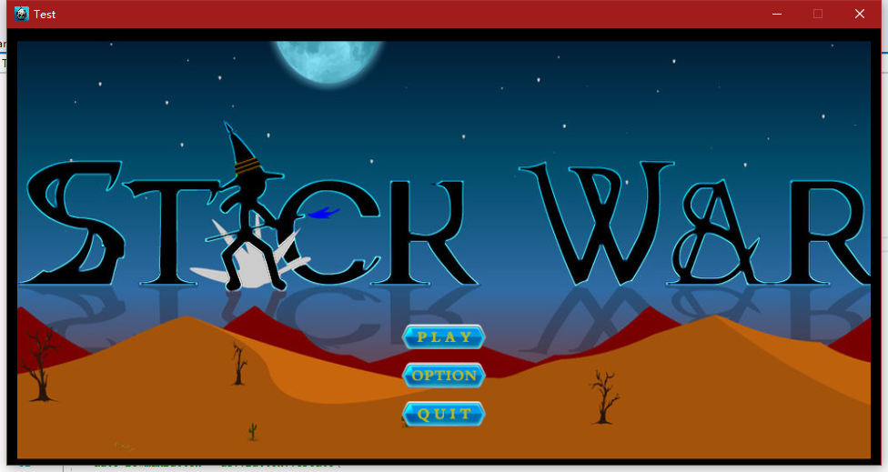
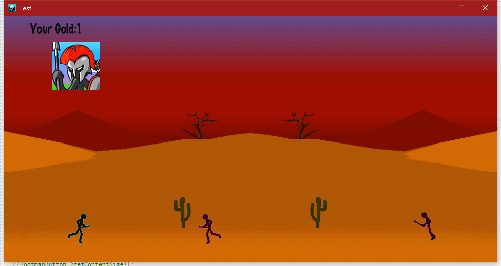
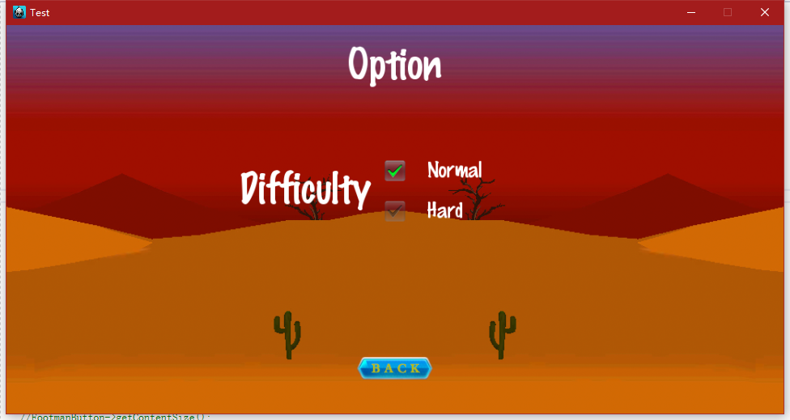
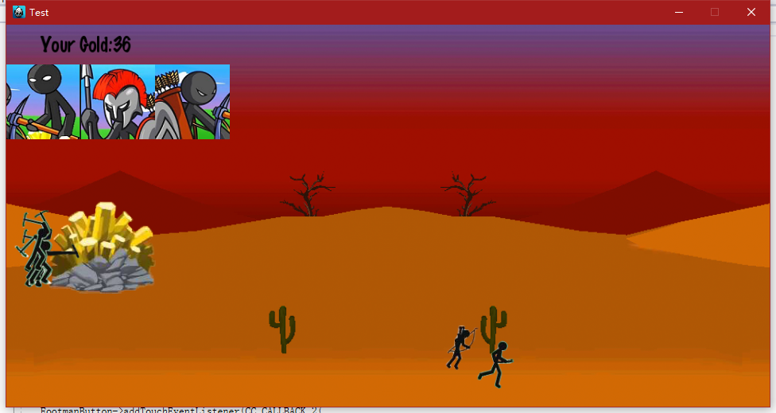
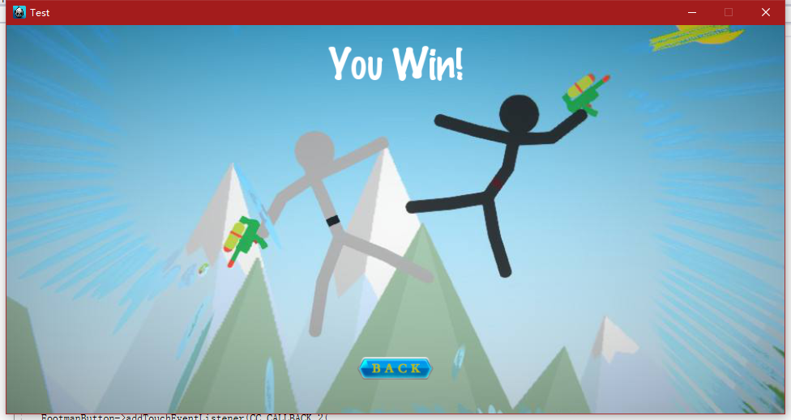
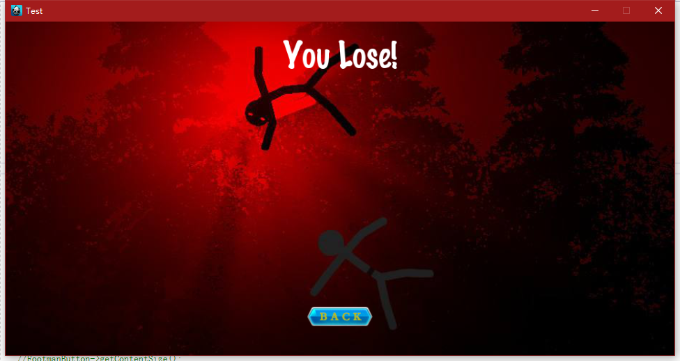

# 报告

 
## 2018年袁昕老师短学期课程
## 一、 问题和背景

见 [需求分析](https://github.com/Mozalic/StickWar/blob/master/doc/%E9%9C%80%E6%B1%82%E5%88%86%E6%9E%90/%E9%9C%80%E6%B1%82%E5%88%86%E6%9E%90.md)  

## 二、 开发环境及工具

本工程是一个火柴人战争的游戏。

本工程基于cocos2d-x引擎。

整体架构参考了Model-View-ViewModel（MVVM）实现。

## 三、 小组内分工

第一轮迭代由胡啸川完成部分Model层，

第二轮迭代由胡啸川完成ViewModel层以及游戏主界面的View层相关工作，。

第三轮迭代由胡啸川完成更多的Model层，完善了View层的相关功能，。

三轮迭代完成，游戏完成。

## 四、 游戏实现的功能及效果图

### 第一轮迭代

第一轮迭代完成了开始界面，而且完成游戏主场景的Model。

### 第二轮迭代

第二轮迭代完成了游戏主场景及难度选择功能。

### 第三轮迭代

第三轮迭代完成了游戏主场景的更多功能。完成了游戏胜利和失败的界面。

## 五、小组成员

胡啸川 3160103783
金晨阳
