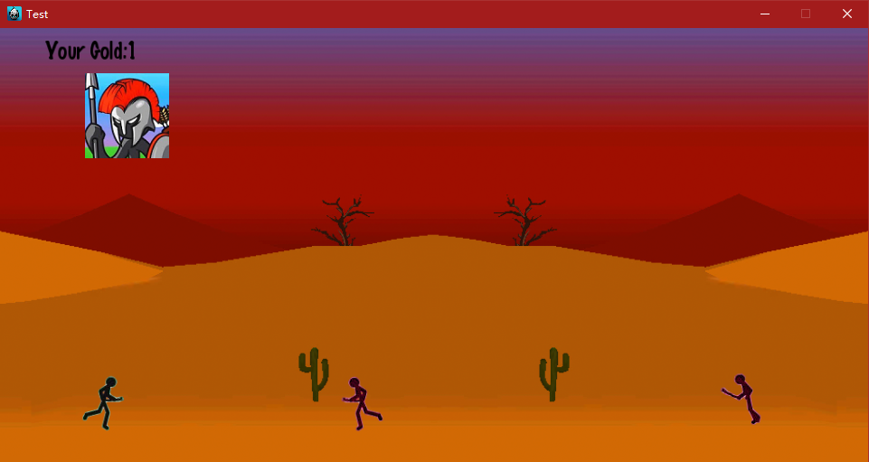
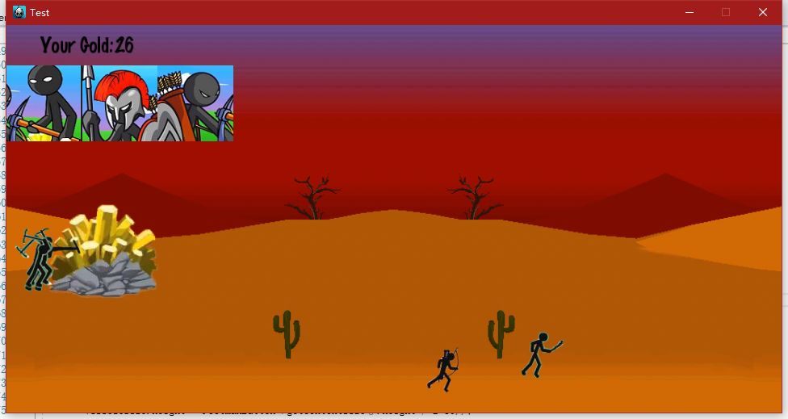

# 胡啸川的个人报告

作为本次项目的组长，我主要负责整个项目的整体统筹与流程设计。

## 任务分工

在项目的初期，我们经过组内讨论，在几个主题中决定利用Cocos2d引擎制作一个小游戏。
在第一次迭代中，我负责部分Model层的设计与制作。
在第二次迭代中，我完成了ViewModel层与部分View层的功能。
在第三次迭代中，我主要完成并完善了游戏主界面的View层的构建。

##设计思路与运行效果

在第一轮迭代，我完成了士兵的Model。

```
#pragma once

#include "cocos2d.h"
#include "ui/CocosGUI.h"

USING_NS_CC;

#define FootmanHP 100

class soldierItem {
private:
	Sprite *soldier;
	float position;
	int hp;
	int type;//1 = Footman, 2=Bowman
public:
	soldierItem();
	soldierItem(Sprite* so,float pos,int HP, int Type);

	static soldierItem* getInstance();
	static soldierItem* getInstance(Sprite* so, float pos, int HP, int Type);
	int getHp();
	void setHp(int x);
	int getType();
	void setType(int x);
	Sprite* getSoldier();
	float getPosition();
	void setPosition(float x);
};
```

在第二轮迭代中我完成的ViewModel和View层的工作，实现了游戏主场景的绘制。
效果图如下：


在第三轮迭代中我完成并完善了游戏主界面的View层的构建，并增加了更多的Model。
效果图如下：


##心得体会

这门课让我学会了MVVM框架的实现方式，不过受限于cocos2d引擎的功能，在开发中我遇到了诸多的困难。尽管遇到了这样那样的困难，我也实际感受到了MVVM框架的便捷性与易用性。
我还学会了AppVeyor的使用，这使得线上的协作变得更为方便。当某一次的commit出现问题时，我们可以通过AppVeyor及时的得到反馈。
这些知识在我之后的协作开发上可以起到极大的帮助。

##对课程的建议

希望可以在开始编辑前提供更多的优秀样例帮助我们更好的理解MVVM框架。
